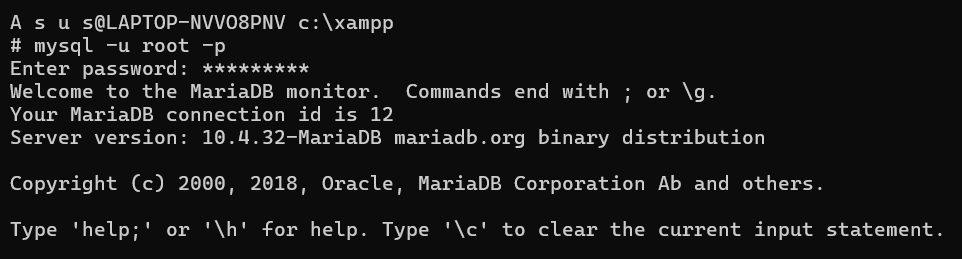
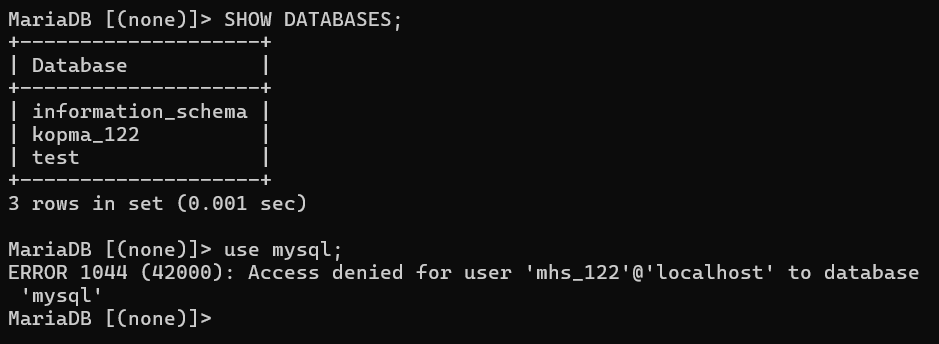
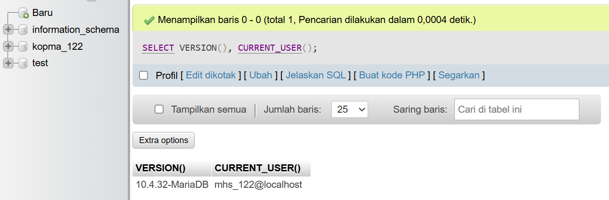
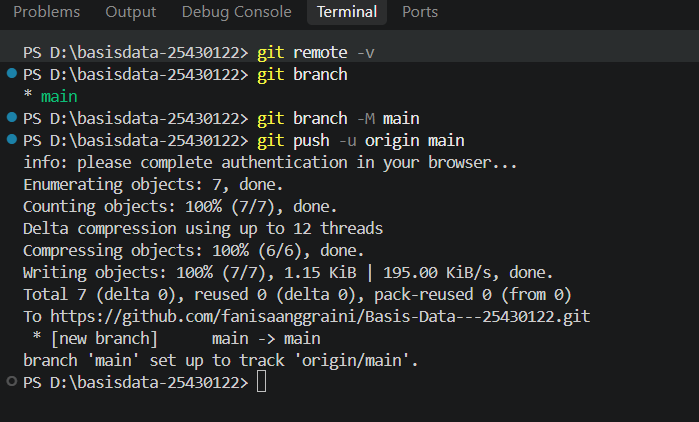
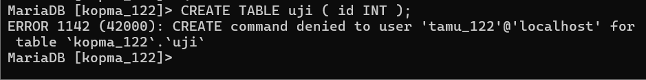
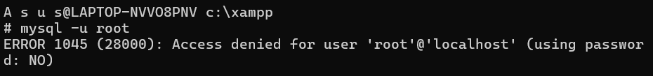
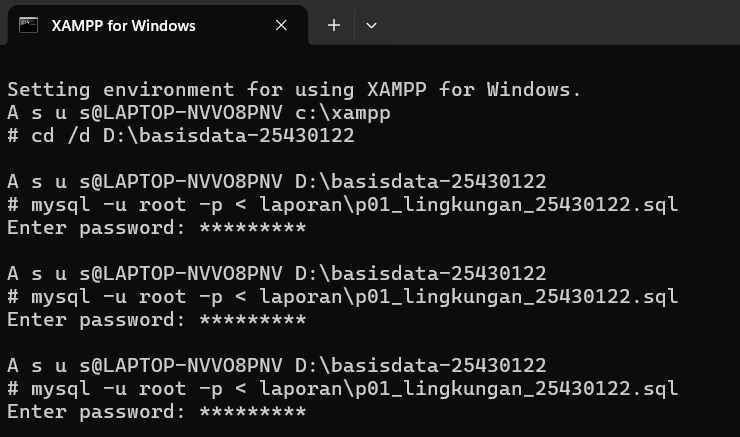
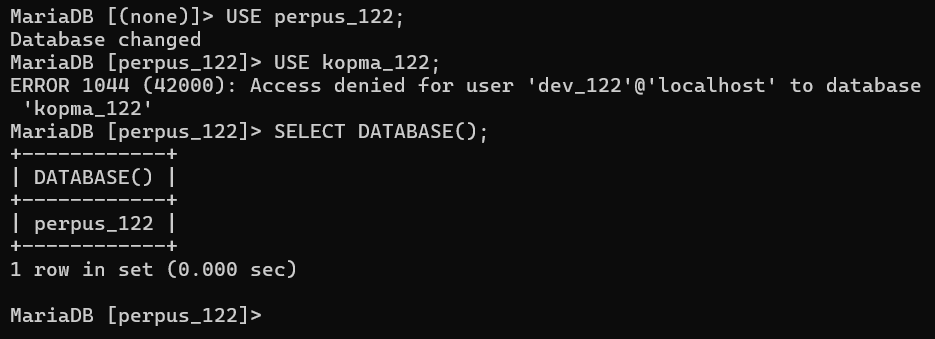

# Laporan Praktikum Basis Data - Pertemuan 1
- **Nama:** Fanisa Anggraini 
- **NIM:** 25430122
- **Kelas:** C
- **Tanggal:** 06/10/2026
- **Dosen:** Dedi Irawan, S.Kom., M.T.I.

## 1. Tujuan Praktikum

1. Memahami cara menjalankan dan memeriksa status layanan MariaDB melalui XAMPP.
2. Mempelajari cara mengakses MariaDB menggunakan CLI dan phpMyAdmin.
3. Memahami cara mengamankan akun root dan membuat akun kerja dengan hak akses terbatas.
4. Mempelajari cara membuat database serta mengelola pekerjaan menggunakan Git dan GitHub.

## 2. Ringkasan Dasar Teori

Basis data merupakan sekumpulan data yang saling berkaitan dan diatur secara sistematis agar dapat dimanfaatkan oleh pengguna serta aplikasi. Pengelolaan basis data dilakukan oleh Sistem Manajemen Basis Data (DBMS), yang mendukung dalam penyimpanan, pencarian, keamanan, serta pengaturan akses data.MariaDB mengadopsi arsitektur client-server, di mana server MariaDB menerima permintaan dari klien seperti mysql melalui Command Prompt atau phpMyAdmin. XAMPP berfungsi sebagai platform kerja yang menyertakan MariaDB, Apache, PHP, dan phpMyAdmin dalam satu bundel.Dalam praktikum, MariaDB bisa diakses lewat CLI maupun phpMyAdmin. CLI lebih simpel digunakan untuk membuat dan menyimpan perintah SQL dalam bentuk skrip yang bisa dijalankan kembali, sedangkan phpMyAdmin menawarkan antarmuka berbasis web yang lebih menarik secara visual.Pengguna MariaDB memiliki akun serta hak akses yang spesifik. Modul menerapkan prinsip hak akses minim, di mana akun root digunakan untuk administrasi, sementara akun kerja hanya diberi izin sesuai dengan kebutuhan. Di samping itu, Git dan GitHub digunakan untuk menyimpan skrip serta mendokumentasikan perubahan pekerjaan melalui commit sehingga proses pengerjaan bisa dipantau.Ini telah diringkas untuk memenuhi persyaratan laporan yang menginginkan ringkasan teori sekitar setengah halaman.

## 3. Hasil Langkah Percobaan

### 3.1 Menjalankan Layanan MariaDB 

### 3.2 Masuk Melalui Klien Baris Perintah

### 3.3 Mengamankan Akun Root 

### 3.4 Membuat Basis Data dan Akun Kerja

### 3.5 Menggunakan phpMyAdmin dengan Aman

### 3.6 Menyiapkan Repositori Git

### 3.6 Analisis Eror 

## 4. Jawaban Titik Analisis

**Analisis 1**
Akibatnya, kita perlu waspada saat mencari solusi kesalahan karena nama yang muncul di XAMPP tidak mencerminkan server yang benar-benar digunakan. Dalam praktikum ini, server yang dipakai adalah MariaDB 10.4.32 meskipun pada tombol XAMPP tertulis MySQL. Dokumentasi MySQL tetap penting untuk sintaks dan konsep SQL yang juga didukung oleh MariaDB. Namun, jika ada masalah terkait perilaku server, pengaturan, fitur, atau pesan kesalahan yang khusus pada MariaDB 10.4.32, dokumentasi MariaDB harus dijadikan acuan utama agar solusi yang diterapkan sesuai dengan kondisi server yang sebenarnya. 

**Analisis 2**
Bagian pesan galat yang menunjukkan bahwa klien tidak mengirim password adalah using password: NO. Nilai tersebut menunjukkan bahwa pada saat mencoba login sebagai root, klien tidak mengirimkan password ke server. Hal ini terjadi karena perintah yang digunakan adalah mysql -u root tanpa opsi -p. Agar klien meminta dan mengirimkan password untuk proses login, perintah yang digunakan adalah mysql -u root -p. 

**Analisis 3**
information_schema tetap muncul karena merupakan database sistem yang digunakan untuk memberikan informasi atau metadata mengenai database dan objek yang terdapat pada server. Kemunculannya di SHOW DATABASES tidak menunjukkan bahwa akun mhs_122 memiliki akses penuh atas seluruh konten server. Sebaliknya, saat mhs_122 mencoba menggunakan mysql, server menolak dengan ERROR 1044 karena akun tersebut tidak memiliki izin untuk mengakses basis data mysql. Ketidaksamaan ERROR 1044 dan ERROR 1045 terletak pada fase penolakannya. ERROR 1044 muncul ketika pengguna telah terhubung ke server namun tidak memiliki hak akses untuk basis data yang diminta. Sementara ERROR 1045 muncul selama proses autentikasi, yaitu ketika server menolak akses pengguna akibat kredensial tidak cocok atau password tidak dikirim sesuai ketentuan.

**Analisis 4**
Mode cookie lebih aman karena pengguna harus memasukkan username dan password ketika membuka phpMyAdmin. Dengan cara ini, password tidak disimpan langsung sebagai kredensial login di dalam file konfigurasi phpMyAdmin. Pada mode config, phpMyAdmin menggunakan kredensial yang telah disimpan dalam konfigurasi sehingga orang yang dapat memperoleh akses ke file konfigurasi tersebut berpotensi mengetahui atau memanfaatkan kredensial tersebut. Oleh karena itu, mode cookie lebih sesuai digunakan agar proses autentikasi dilakukan secara langsung oleh pengguna.

## 5. Hasil Latihan dan Modifikasi

Terjadi galat ERROR 1045 (Access denied) saat login sebagai root karena password tidak dikirim pada proses autentikasi. Setelah opsi password digunakan, proses login root dapat dilakukan kembali. 

Script SQL berhasil dijalankan dua kali secara berturut-turut tanpa menimbulkan galat. Hal ini menunjukkan bahwa penggunaan IF NOT EXISTS membuat script dapat dijalankan kembali meskipun database dan akun pengguna sebelumnya sudah tersedia. 

## 6. Tugas Mandiri: Milestone Proyek 1

Berdasarkan dua digit terakhir NIM, proyek yang digunakan memiliki tema Perpustakaan dengan kode tema `perpus`. Database proyek yang dibuat adalah `perpus_122` dan akun proyek yang digunakan adalah `dev_122`. Pada milestone ini telah dibuat database proyek, akun `dev_122` dengan hak
akses terbatas pada database proyek, serta pengujian akses terhadap database `kopma_122`. README.md telah dilengkapi dengan identitas proyek dan lingkup layanan, sedangkan file `.gitignore` digunakan untuk mencegah file yang berisi kredensial masuk ke repository. Seluruh hasil pekerjaan telah disimpan, di-commit, dan di-push ke repository GitHub sebagai bagian dari Milestone Proyek 1.

## 7. Pembahasan dan Kendala

Selama praktikum terdapat beberapa kendala, seperti ERROR 1045 saat login root dan error saat menjalankan script SQL menggunakan operator `<` pada PowerShell. Selain itu, terdapat kendala pada konfigurasi Git, seperti Git yang belum terbaca oleh terminal dan identitas pengguna yang belum diatur. Kendala tersebut dapat diatasi dengan memperbaiki penggunaan password, menjalankan script melalui Command Prompt, serta mengatur PATH dan konfigurasi Git hingga proses commit dan push ke GitHub berhasil. 

## 8. Kesimpulan

1. Praktikum Modul 1 berhasil membantu memahami penggunaan MariaDB melalui XAMPP, CLI, dan phpMyAdmin.
2. Pengelolaan akun dan hak akses dapat diterapkan untuk membatasi penggunaan database sesuai kebutuhan.
3. Git dan GitHub berhasil digunakan untuk menyimpan, mencatat, dan mengelola hasil praktikum serta proyek secara bertahap.

## 9. Pernyataan Penggunaan AI

AI digunakan sebagai alat bantu dalam memahami materi praktikum, menjelaskan pesan galat yang muncul, memberikan panduan penggunaan perintah, serta membantu merapikan penyusunan laporan.

## 10. Bukti Git

* **Tautan Repositoi:** (https://github.com/fanisaanggraini/Basis-Data---25430122)
* **Hash Commit:** (f92e003 (HEAD -> main, origin/main) p01: inisialisasi repositori dan skrip lingkungan)

## Checklist

- [x] Identitas, tujuan, teori, dan kesimpulan laporan lengkap
- [x] Hasil langkah percobaan dan screenshot lengkap
- [x] Titik Analisis 1–4 dijawab
- [x] Latihan dan modifikasi selesai serta dibuktikan
- [x] Milestone Proyek 1 selesai
- [x] `p01_lingkungan_25430122.sql` tersedia dan dapat dijalankan ulang
- [x] `README.md` dan `.gitignore` tersedia
- [x] Database proyek `perpus_122` dan akun `dev_122` dibuat
- [x] Hak akses akun proyek diuji
- [x] Perbedaan ERROR 1044, 1045, dan 1142 dijelaskan
- [x] Pernyataan penggunaan AI dicantumkan
- [x] Bukti Git dan GitHub lengkap